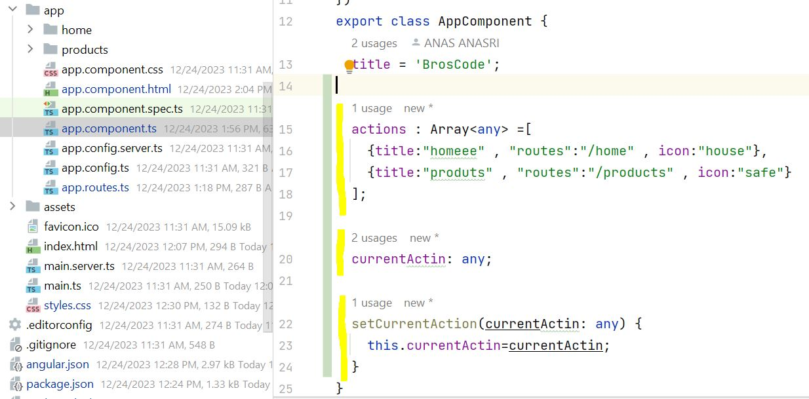
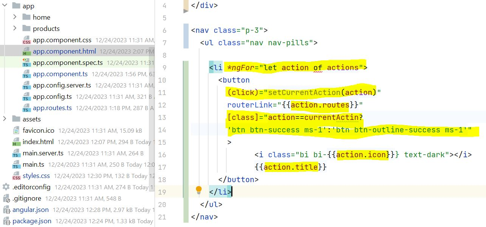
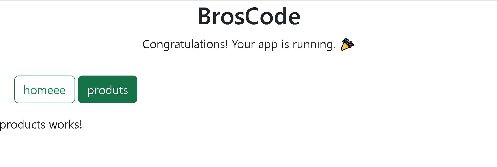
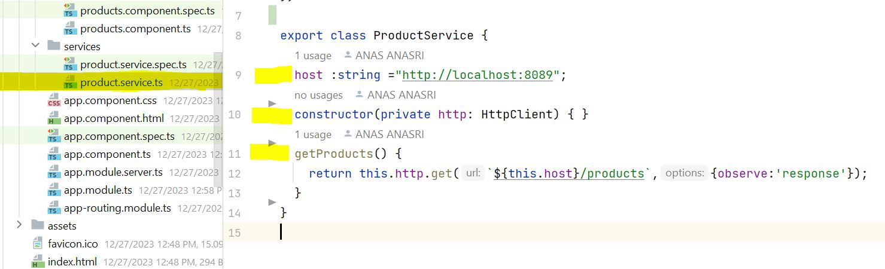
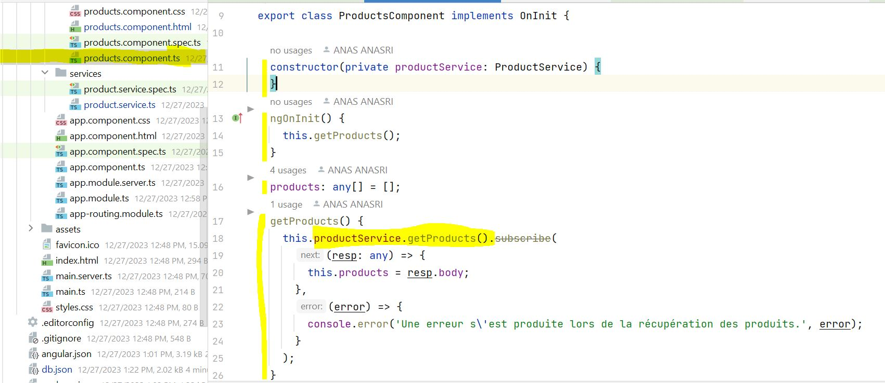
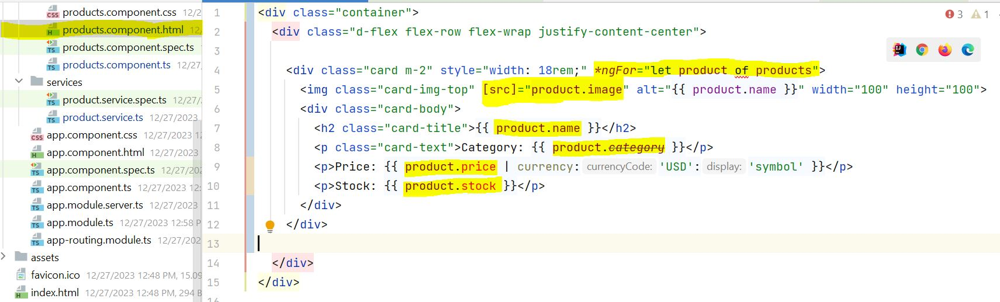
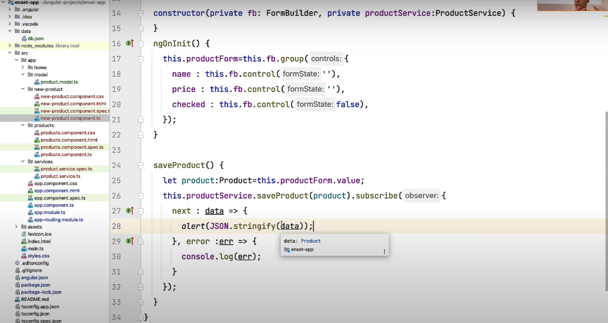
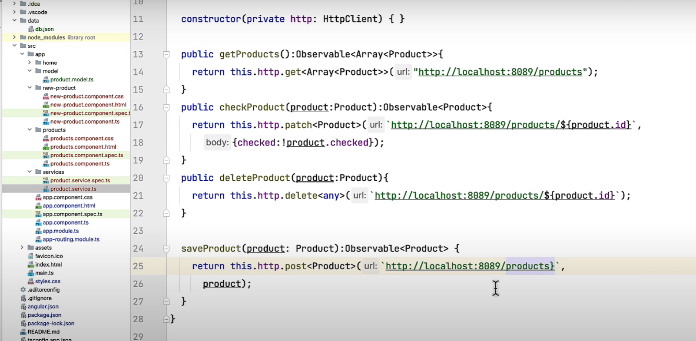

# BrosCode

## Ex1
### -1--------

### -2--------

### -3--------

## Ex2
### -1--------

### -2--------

### -3--------

## Ex3
### -1--NEW PRODUCT COMPONENT------

### -2--FORMULAIRE HTML------

### -3--SERVIE (add in backend)------

